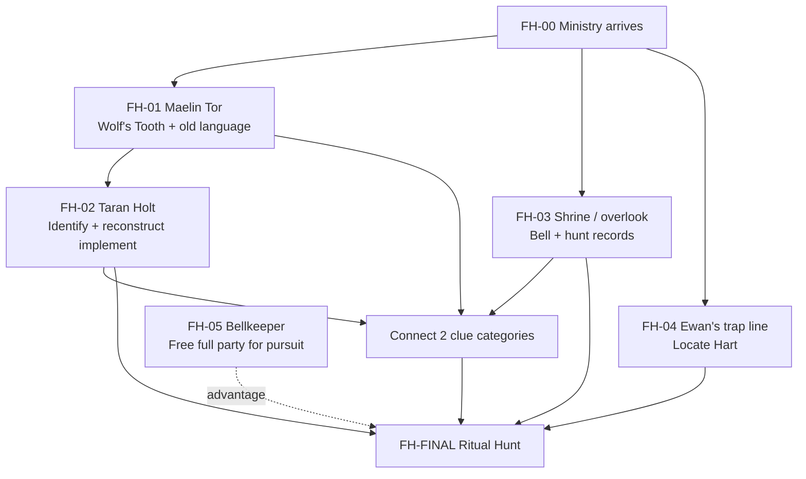

# Workflow Design
{: tabindex="-1" }

_Status: working playtest design. Canonical state lives in `_data/adventures/forests-hart/`._

## Core arc

1. The Ministry arrives after Mayor Elara Venn reports malformed wildlife, crop failure, and a tainted water supply.
2. Investigation reveals a long spiritual decline and traces the recent escalation to Ewan Rusk's neglected trap line.
3. The party recovers the Wolf's Tooth, studies old Coedmyr traditions, reconstructs the ceremonial implement, and finds the forgotten shrine.
4. Connecting at least two independent clue categories reveals that the old rite was a spiritual hunt and that helping the Hart means completing its interrupted natural passage.
5. The party activates the shrine bell, follows and drives the Hart toward the shrine, manages consequences from its corrupted wake, and completes the rite with the Wolf's Tooth.

## Preparation model

- **FH-01 — Maelin Tor:** obtain the Wolf's Tooth and archaic language about mercy and an appointed end.
- **FH-02 — Taran Holt:** identify the cold-iron relic as part of a traditional implement and reconstruct it with the party's help.
- **FH-03 — Shrine and overlook:** discover the bell, aura, separate bellkeeper role, and records of the old spiritual hunt.
- **FH-04 — Ewan's trap line:** locate the Hart and learn that ordinary intervention does not resolve the disturbance. Freeing it early is allowed but makes later reacquisition necessary.
- **FH-05 — Bellkeeper:** recruit Ewan or another willing villager so all four PCs can join the pursuit.

The reconstructed Wolf's Tooth, shrine, and reconstructed truth are required before the final rite. Other preparation changes how difficult the final sequence becomes.

## Finale

**Trigger:** Strike the shrine bell with the reconstructed Wolf's Tooth.

**Pursuit:** The bell calls the Hart toward the shrine but does not compel its route. The party must keep contact and drive it along the old hunt path. Failed obstacles increase **breach pressure**, representing corrupted problems reaching the bellkeeper first.

**Shrine:** Breach pressure determines how unstable the shrine phase is when the party arrives. The maintained aura suppresses corruption while the party protects the rite and exposes the Hart beneath its liminal corruption.

**Final passage:** Once the Hart is exposed inside the active aura, a character adjacent to it can spend 1 action with the Wolf's Tooth to complete the rite. No final check is required.

## Dependency graph

## Mock test rule

For each simulated path, record what the party currently believes, what options they know exist, what action they are most likely to take next, whether missing content creates an arbitrary dead end, and how each preparation changes the finale.
