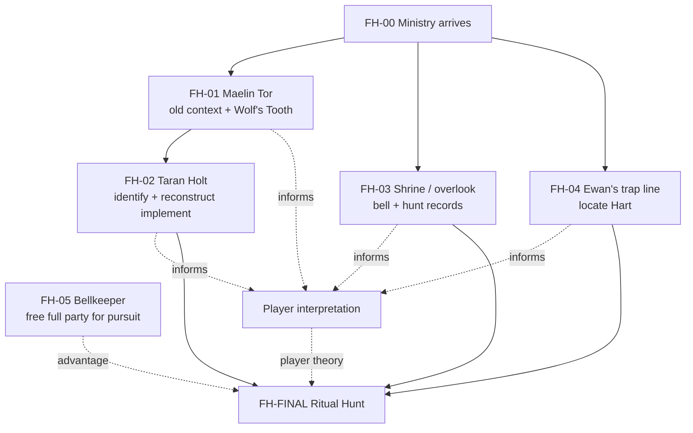

# Workflow Design
{: tabindex="-1" }

_Status: working playtest design. Canonical state lives in `_data/adventures/forests-hart/`._

## Core arc

1. The Ministry arrives after years of low-priority reports from remote Coedmyr finally culminate in Elara Venn's absurd claim that a slaughtered chicken got up and killed a neighbor's cat. The claim gets a team sent because it is strange enough to check, not because the Ministry treats it as proven evidence.
2. Investigation separates mundane local problems from the broader outbreak, reveals disorganized biological growth across the region, and traces the recent escalation to Ewan Rusk's neglected trap line.
3. The party recovers the Wolf's Tooth, studies old Coedmyr stewardship and pilgrimage traditions, reconstructs the ceremonial implement, and discovers the ruined shrine.
4. Independent clues remain compatible but do not trigger an automatic reveal. The players must decide what the old hunt meant and what they think the rite is supposed to accomplish.
5. The party activates the shrine bell, follows and drives the Hart toward the shrine, manages consequences from its corrupted wake, and completes the rite with the Wolf's Tooth.

## Cultural frame

Coedmyr was a difficult-to-reach spiritual pilgrimage destination. Visitors came specifically for the forest, shrines, vigils, old hunts, and other local practices. As the forest declined, those practices faded and pilgrims stopped making the journey.

The old tradition joined reverence with stewardship. Healthy care for the forest included limits, harvest, predation, culling, fire, rest, and making room as well as growth. Iron-Maw represents this necessary destructive side of stewardship. The Hart is not normally something that has "strayed" and needs to be returned.

The overlook survived longest by becoming the accessible, pleasant part of the old pilgrimage: meditation, exercise, prayer, views, picnics, and simplified ceremony. That preservation was sincere, but it also helped turn a working tradition into tourism and symbolism.

## Preparation model

- **FH-00 — Arrival and first investigation:** Elara supplies symptoms and local history. The spring can provide a mundane explanation for the water problem without explaining the wider outbreak. A dusk incursion provides undeniable evidence and can introduce Ewan if the party has not already sought him out.
- **FH-01 — Maelin Tor:** gain old stewardship context and recover the Wolf's Tooth. Maelin speaks an archaic local dialect; Nessa translates imperfectly. The relic may be found by searching his crowded collection early or recognized later when the party mentions Iron-Maw, the old hunt, the shrine implements, or the bell.
- **FH-02 — Taran Holt:** identify the cold-iron relic as part of a traditional implement and reconstruct it with the party's help.
- **FH-03 — Shrine and overlook:** discover the bell, weak aura, separate bellkeeper role, old hunt records, and the surviving spirit trail.
- **FH-04 — Ewan's trap line:** follow a progression from neglected traps to a severely malformed doe, increasingly abnormal forest conditions, and finally the trapped Hart at the center of the strongest effect.
- **FH-05 — Bellkeeper:** recruit Ewan or another willing villager so all four PCs can join the pursuit.

The completed Wolf's Tooth implement is the true gate. Other discoveries shape what the party understands and how difficult the finale becomes, but no clue-count threshold produces the answer for them.

## Hart source encounter

Environmental abnormalities begin well before the Hart, roughly one or two minutes out from the trap. Growth, fungi, insects, roots, and other biological activity become increasingly excessive toward the source.

The Hart itself is unmistakably exceptional without relying on antlers. Its coat, eyes, proportions, movement, and presence distinguish it immediately from mundane malformed wildlife.

Its concentrated aura has a 25-foot hazardous radius. Entering or remaining within it calls for a DC 32 Fortitude save during structured play. Effects should be concrete bodily responses such as inflamed scars, excessive tender tissue around cuts, swelling at old injuries, or painful nail and hair growth. The environment telegraphs the danger well beyond the mechanical boundary.

## Finale

**Trigger:** Strike the shrine bell with the reconstructed Wolf's Tooth.

**Pursuit:** The bell calls the Hart toward the shrine but does not compel its route. The party must keep contact and drive it along the old hunt path. Failed obstacles increase **breach pressure**, representing corrupted problems reaching the bellkeeper first.

**Shrine:** Breach pressure determines how unstable the shrine phase is when the party arrives. The maintained aura suppresses corruption while the party protects the rite and exposes the Hart beneath its liminal corruption.

**Final passage:** Once the Hart is exposed inside the active aura, a character adjacent to it can spend 1 action with the Wolf's Tooth to complete the rite. No final check is required.

## Dependency graph

## Mock test rule

For each simulated path, record what the party currently believes, what options they know exist, what action they are most likely to take next, whether missing content creates an arbitrary dead end, and how each preparation changes the finale. Do not convert accumulated clues into an automatic GM explanation.
