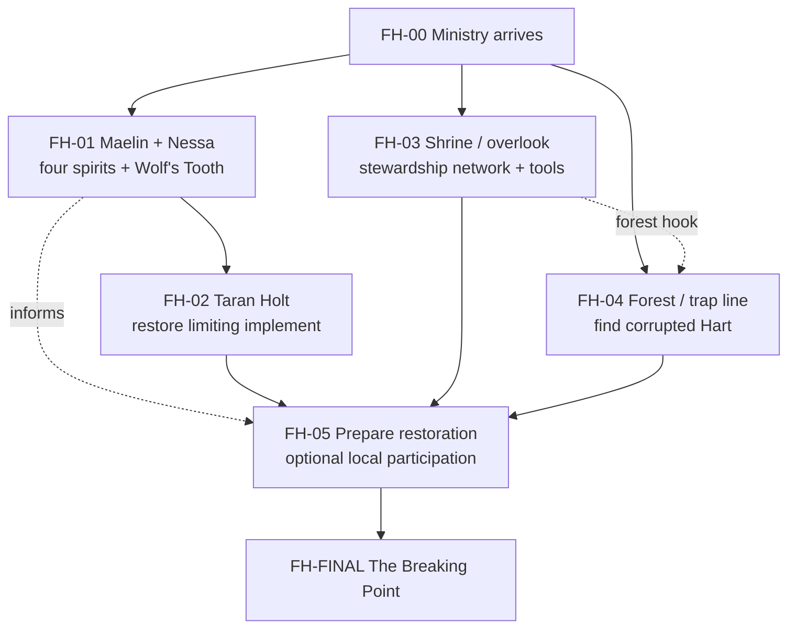

# Workflow Design
{: tabindex="-1" }

_Status: working playtest design. Canonical state lives in `_data/adventures/forests-hart/`._

## Core arc

1. The Ministry arrives after years of low-priority reports from remote Coedmyr finally culminate in Elara Venn's absurd claim that a slaughtered chicken got up and killed a neighbor's cat.
2. Investigation separates mundane local problems from the broader outbreak and gradually shows life processes continuing with impossible intensity: healing becomes overgrowth, repair becomes deformity, and renewal persists beyond healthy limits.
3. The party reconstructs Coedmyr's old stewardship culture through Maelin, Nessa, Sera, Taran, surviving relics, the overlook, and the shrine. The four recurring spirits represent life, death, change, and tradition rather than a rigid ritual sequence.
4. Ewan's neglected trap line leads to the Hart, which is both the source of the runaway vitality and its victim. The party should naturally conclude that the Hart needs to be saved.
5. The party assembles a restoration from surviving practices. Wolf-associated tools impose limits, Turtle-associated practices stabilize, Bird-associated practices guide or redirect, and Hart-aligned stewardship consists of actual tending and restoration.
6. The restoration initially works, then breaks. The Hart flees or containment moves, turning the rescue into an improvised pursuit rather than a reenacted ritual hunt.
7. Final containment reveals that the corruption is inseparable from this physical Hart manifestation. The party must choose whether to kill it with the Wolf's Tooth, continue searching for another solution, or abandon Coedmyr to the consequences.

## Spiritual ecology

Coedmyr's folklore belongs to a broader continent-wide spiritual tradition whose details vary by region.

- **The Hart — life:** vitality, renewal, recovery, succession, replacement after loss.
- **The Wolf — death:** limits, predation, restraint, culling, endings.
- **The Bird — change:** movement, adaptation, migration, seasonal transition.
- **The River Turtle — tradition:** continuity, memory, persistence, accumulated knowledge.

These figures are not four mandatory keys. Their value is that Coedmyr's old practices kept their principles in relationship.

The Hart's current corruption is not an invading substance. Its own vitalizing nature has become distorted inside a damaged spiritual ecology. Ewan's unattended trap is the acute breach point: an injured and trapped Hart responds with runaway renewal in a community that has lost much of the restraint, adaptability, memory, and coordinated stewardship that once shaped its relationship with the forest.

Life without limits becomes destructive. Tradition without change becomes empty form. Change without continuity loses accumulated knowledge. Death without renewal becomes sterility.

## Cultural frame

Coedmyr was a difficult-to-reach spiritual pilgrimage destination. Visitors came specifically for the forest, shrines, vigils, seasonal practices, and other local traditions.

The old tradition joined reverence with stewardship. The pilgrimage overlook served as a spiritual center and practical watchpoint. A keeper based there watched conditions, preserved working knowledge, and coordinated work distributed among hunters, farmers, shrine tenders, craftspeople, and other residents.

As the village declined, pilgrimage became increasingly concentrated around pleasant and accessible practices. The overlook survived through meditation, exercise, tea, prayer, views, picnics, and simplified ceremony while harder forest work and the deeper keeper institution disappeared.

Sera sincerely preserves what she inherited, but she did not inherit the complete keeper office. Maelin preserves older language and stories but is not an oracle. Taran supplies practical skepticism. Elara prioritizes village survival. Ewan embodies a concrete failure inside a broader decline without becoming the sole cause.

## Preparation model

- **FH-00 — Arrival:** establish ordinary decline, uncertain evidence, the spring red herring, and a dusk wildlife incursion.
- **FH-01 — Maelin and Nessa:** recover four-spirit context, fragmented stewardship history, and the Wolf's Tooth without teaching a Hart-killing cycle.
- **FH-02 — Taran:** reconstruct the Tooth as a usable tool of restraint and limitation, not a purpose-built execution weapon.
- **FH-03 — Overlook and shrine:** reveal the old distributed stewardship system, the bell's suppressive effect, and optional Turtle- or Bird-associated practices that can strengthen a restoration attempt.
- **FH-04 — Trap line:** progress from neglected traps to a malformed doe and finally the corrupted, trapped Hart. The Hart should remain visibly worth saving.
- **FH-05 — Prepare the Restoration:** recruit or involve villagers through existing relationships and assemble a plausible rescue from surviving practices.
- **FH-FINAL — The Breaking Point:** begin with restoration, allow genuine early success, turn the breakdown into an improvised pursuit, then reveal that this manifestation cannot be restored with the available system.

The completed Wolf's Tooth remains an important mechanical gate because the party needs a way to impose limits on the runaway vitality. It should not function as a narrative spoiler for the final lethal choice.

## Doe investigation

The doe should show excessive and maladaptive healing rather than a creature unable to finish dying.

Bone remodeling continues around the trap jaws but overgrows the joint instead of restoring it. Inflammation and infection remain active beneath layers of new tissue. Skin or muscle repair incorporates debris or forms useless masses. The apparent rate of healing does not match the age of the injury.

The investigator can establish that the trap itself is ordinary and reconstruct the impossible timing. A druid or another suitable specialist can establish that life processes are being unnaturally intensified and that a wider spiritual disturbance is influencing them. Neither result identifies the Hart as the source.

## Hart source encounter

Environmental abnormalities begin well before the Hart. Growth, fungi, insects, nesting, wound response, flowering, rooting, and other expressions of life become increasingly excessive or malformed toward the source.

The Hart is unmistakably exceptional and visibly corrupted, but it should remain beautiful enough that saving it feels like the obvious objective. Its wounds heal incorrectly. New tissue or antler growth distorts otherwise graceful anatomy. Exhaustion and fear remain legible beneath the supernatural vitality.

Its concentrated aura retains a 25-foot hazardous radius and DC 32 Fortitude save during structured play. Effects should manifest as runaway growth or repair in the exposed character's own body.

## Communal response

The response should not function as a hidden NPC optimization puzzle.

A few named villagers plus interested locals are enough to show renewed local willingness to take responsibility for the forest. Everyone who joins should believe they are helping rescue the Hart and contain the outbreak.

Earlier relationships matter most once the rescue fails. Sera may resist killing the Hart, Elara may prioritize survival, Ewan may be paralyzed by responsibility, Maelin may recognize the Wolf's principle without claiming divine authority, Taran may focus on practical failure, and Nessa may reject false certainty from fragmentary tradition.

No NPC decides the final choice.

## Finale

**Attempted restoration:** The party uses the shrine and recovered practices to suppress, stabilize, redirect, and tend the Hart. It should appear to work at first.

**Break:** The condition surges through the Hart again. Pain, panic, or containment failure sends it moving.

**Pursuit:** The party must stay with the Hart and protect Coedmyr from its corrupting wake. This becomes a hunt only in the ordinary sense after the rescue fails; no old ritual told them to hunt it.

**Containment:** Reestablished boundaries briefly make the Hart lucid and coherent. Repeated attempts at restoration reveal that corruption returns from within the manifestation and cannot be separated with the surviving practices.

**Conflict:** Villagers react according to their beliefs and relationships with the party. The cost of continued rescue becomes immediate and visible.

**Final choice:** The party can infer that the Wolf's Tooth, already established as a tool that imposes limits, can impose the ultimate limit on the corrupted manifestation. No tradition instructs them to do so.

Killing the Hart stops the acute catastrophe but leaves the long-term spiritual consequence unknown. Continued rescue attempts remain valid player choices and should be adjudicated from established fiction rather than rejected by fiat.

## Dependency graph

## Mock test rule

Do not repeatedly simulate the optimal breadcrumb path. Vary branch order and allow failed checks, missed clues, incorrect hypotheses, early Hart release, skipped NPCs, and weak local relationships.

Track whether players plausibly believe the Hart can be saved before the finale, whether the failed restoration feels earned rather than predetermined, and whether their earlier relationships materially change the social pressure of the final choice.
