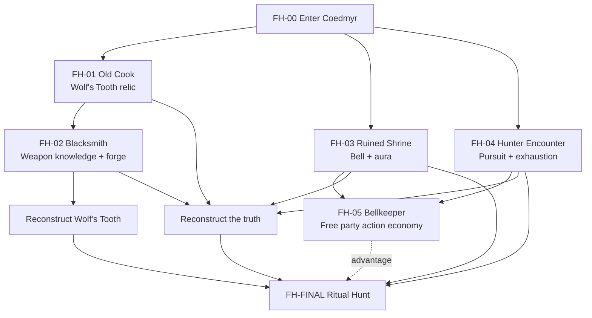

# Workflow Design
{: tabindex="-1" }

_Status: working playtest design._

## Core arc

1. Enter Coedmyr through the corrupted Hart's wake.
2. Explore competing village beliefs while assuming the Hart must be saved or purified.
3. Recover practical preparations whose original purpose has been forgotten.
4. Reinterpret those preparations and realize the Hart is trapped between life and death.
5. Perform the ritual hunt: activate the bell, pursue and exhaust the Hart, reach the shrine, and complete its natural passage.

## Preparation model

- **FH-01 — Wolf's Tooth relic:** recover the essential ritual object.
- **FH-02 — Blacksmith:** recognize the relic as a weapon component and reconstruct it with PC participation.
- **FH-03 — Shrine:** discover the bell, protective aura, destination, and separate bellkeeper role.
- **FH-04 — Hunter encounter:** learn that ordinary force does not resolve the Hart and that pursuit can exhaust it.
- **FH-05 — Bellkeeper:** recruit and train a local so the full party can participate in the pursuit.

Only the reconstructed Wolf's Tooth is currently intended as a true gate. Other missing preparations increase final difficulty.

## Finale

**Trigger:** Strike the shrine bell with the reconstructed Wolf's Tooth.

**Pursuit:** Use a modified PF2e chase structure. Success keeps pressure on the Hart and builds exhaustion. Failure carries remaining corruption and stronger pressure into the shrine phase.

**Shrine:** The maintained bell aura suppresses or excludes corrupted side threats while the Hart is brought to its final vulnerable state.

**Final passage:** The Wolf's Tooth reaches the mortal creature beneath the remaining liminal corruption.

## Dependency graph

## Mock test rule

For each simulated path, record what the party currently believes, what options they know exist, what action they are most likely to take next, whether any missing content creates an arbitrary dead end, and how each preparation changes the finale.
