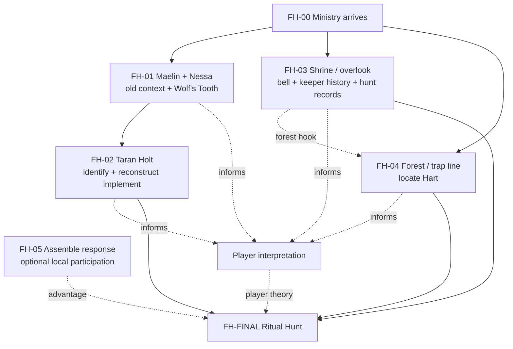

# Workflow Design
{: tabindex="-1" }

_Status: working playtest design. Canonical state lives in `_data/adventures/forests-hart/`._

## Core arc

1. The Ministry arrives after years of low-priority reports from remote Coedmyr finally culminate in Elara Venn's absurd claim that a slaughtered chicken got up and killed a neighbor's cat. The claim gets a team sent because it is strange enough to check, not because the Ministry treats it as proven evidence.
2. Investigation separates mundane local problems from the broader outbreak and gradually shows that ordinary natural processes are occurring at contradictory rates or failing to resolve cleanly into one another. Early evidence should still permit the theory that a neglected forest is simply reclaiming a dying village.
3. The party recovers the Wolf's Tooth, studies old Coedmyr stewardship and pilgrimage traditions, reconstructs the ceremonial implement, discovers the ruined shrine, and traces the recent escalation to Ewan Rusk's neglected trap line.
4. Independent clues remain compatible but do not trigger an automatic reveal. The players must decide what the old hunt meant and what they think the rite is supposed to accomplish.
5. The party activates the shrine bell, follows and drives the Hart toward the shrine, manages consequences from its disordered wake, and creates a state in which the Hart's physical manifestation can complete its expected passage.

## Underlying spiritual ecology

The current crisis is a **disturbance or disjunction**, not an invading corruption substance and not a simple excess of vitality.

The Hart's physical manifestation was caught in Ewan's neglected trap and remained anchored beyond the point when that manifestation should naturally have passed. The Hart normally represents renewal, succession, recovery, and replacement after loss. Its failure to move on does not simply produce more renewal. Instead, natural processes that normally constrain and follow one another increasingly lose coordination around the anchored manifestation.

Growth may continue beside decomposition. Repair may continue without restoring function. Inflammation and infection may remain active beneath new tissue. Migration, predation, crowding, and recovery can occur at the wrong time or fail to hand off into the next process.

From a distance this should look like ecological decline, neglect, invasive growth, disease, or a forest reclaiming a shrinking settlement. The supernatural explanation becomes persuasive only as the party accumulates combinations that should not physically coexist or uses appropriate spiritual investigation.

## The four spirits

Coedmyr's folklore belongs to a broader continent-wide spiritual tradition whose names and details vary by region.

- **The Hart** — renewal, succession, recovery, replacement after loss. It can take mortal physical form; a manifestation is not the whole greater spirit.
- **The Wolf** — removal, predation, selection, limits, endings. Old stories often place the Wolf after the Hart, taking a manifestation whose season has ended.
- **The River Turtle** — persistence, circulation, water, soil, and long-duration natural systems.
- **The Bird** — movement, migration, dispersal, seasonal change, and passage between places.

The Turtle and Bird are background lore in this adventure. Their stories give Maelin, Nessa, and the archive material that does not conveniently point toward the solution.

The Wolf's Tooth is a human-forged ritual object associated with the Wolf. It is not a literal tooth or spirit fragment. In Coedmyr's old hunt, human participants used the Tooth to enact the Wolf's role in completing the mortal passage of a Hart manifestation.

## Cultural frame

Coedmyr was a difficult-to-reach spiritual pilgrimage destination. Visitors came specifically for the forest, shrines, vigils, old hunts, and other local practices.

The old tradition joined reverence with stewardship. The pilgrimage overlook served as a spiritual center and practical watchpoint. A keeper based there watched conditions, preserved working knowledge, and coordinated work distributed among hunters, farmers, shrine tenders, craftspeople, and other residents.

As the forest and village declined, pilgrimage became increasingly concentrated around pleasant and accessible practices. The overlook survived through meditation, exercise, tea, prayer, views, picnics, and simplified ceremony while the harder forest traditions and the deeper keeper institution disappeared.

Sera Wynn did not inherit the complete keeper office or its hidden knowledge. She apprenticed under the previous overlook caretaker and later inherited responsibility for the site. Her training preserved ceremonies, stories, habits, and a sincere moral concern for the forest, but not a full understanding of the older institution or complete ritual procedure. Discovering what the overlook once coordinated is part of the investigation rather than knowledge Sera begins with.

The decline of stewardship should mostly appear through physical texture and conflicting local accounts rather than turning every investigation branch into a lesson about communal failure.

## Preparation model

- **FH-00 — Arrival and first investigation:** Elara supplies symptoms and local history. The spring provides a mundane explanation for the water problem without explaining the wider outbreak. A dusk incursion provides stronger evidence and can introduce Ewan if the party has not already sought him out.
- **FH-01 — Maelin Tor and Nessa:** gain old stewardship context, broader four-spirit folklore, fragments of the lost keeper institution, and recover the Wolf's Tooth. Their conversation should also contain irrelevant stories, old customs, and translation disagreements.
- **FH-02 — Taran Holt:** identify the cold-iron relic as a human-made part of a traditional implement and reconstruct it with the party's help.
- **FH-03 — Shrine and overlook:** discover the bell, weak aura, recognizable keeper role, old hunt records, and the surviving spirit trail. Archive material can gradually reveal that the overlook once coordinated practical work across the village. If the party has not meaningfully entered the forest, the trail can surface abnormal cries, malformed tracks, or abandoned trapping infrastructure that intersects Ewan's existing trap line.
- **FH-04 — Ewan's trap line:** follow a progression from neglected traps to a severely malformed doe, increasingly contradictory natural processes, and finally the trapped Hart at the center of the strongest disturbance. Other hunters have reduced coverage as game declined, but Ewan specifically left live traps unattended. His trap is the incidental accelerant for the acute crisis rather than the cause of Coedmyr's long decline.
- **FH-05 — Assemble a response:** once the party understands that the shrine must remain active while the Hart is pursued, they can involve villagers they have built relationships with. Participation is optional and should show renewed local interest in the traditions. Exact NPC jobs remain undefined until the final encounter mechanics are designed.

The completed Wolf's Tooth implement is the true gate. Other discoveries shape what the party understands and how difficult the finale becomes, but no clue-count threshold produces the answer for them.

## Doe investigation

The doe should not imply that the players ought to conclude it is "unable to finish dying." Present contradictory evidence instead.

Bone remodeling continues around the trap jaws without restoring alignment. Inflammation and infection remain active alongside layers of new tissue. Skin or muscle repair incorporates debris or proceeds in incompatible directions. The apparent amount of repair may not match the age of the injury.

The investigator can establish that the trap itself is ordinary and reconstruct the impossible timing. The druid or another suitable spiritual specialist can establish that the animal's natural processes are failing to resolve cleanly and that a wider spiritual disturbance is influencing them. Neither result identifies the Hart as the source or provides the ritual solution.

## Hart source encounter

Environmental abnormalities begin well before the Hart, roughly one or two minutes out from the trap. Growth, fungi, insects, decay, wound response, and other biological activity become increasingly contradictory or badly timed toward the source.

The Hart itself is unmistakably exceptional without relying on antlers. Its coat, eyes, proportions, movement, and presence distinguish it immediately from mundane wildlife. It should look trapped and exhausted rather than grotesquely malformed.

Its concentrated aura has a 25-foot hazardous radius. Entering or remaining within it calls for a DC 32 Fortitude save during structured play. Effects should be concrete responses in the exposed character's own body, such as inflamed scars, excessive tissue around cuts, swelling at old injuries, or painful nail and hair growth.

The aura is not a cloud of corruption emitted by the Hart. It is the strongest local expression of the spiritual disjunction surrounding a manifestation that has remained anchored past its proper transition.

## Communal response

The response should not function as a hidden NPC optimization puzzle.

The old carvings and records can establish that the shrine was operated while hunters and other participants worked elsewhere. The party can involve villagers once they understand that the rite requires coordination, but no particular NPC is required and no specific person is the canonical bellkeeper.

A few named villagers plus interested locals are enough to show that Coedmyr is willing to recover parts of the old tradition. Their exact mechanical jobs, action benefits, and encounter responsibilities remain open until the finale is fully designed.

Without local help, the Ministry can still attempt containment alone.

## Finale

**Trigger:** Repeatedly strike the shrine bell with the reconstructed Wolf's Tooth.

**Pursuit:** The bell calls the Hart toward the shrine but does not compel its route. The party must keep contact and drive it along the old hunt path. Failed obstacles increase **breach pressure**, representing disordered problems reaching the shrine response first.

**Shrine:** Breach pressure determines how unstable the shrine phase is when the party arrives. The maintained aura suppresses the local disjunction and temporarily restores enough order around the Hart manifestation for it to become coherent, lucid, and mortal again. It does not extract an emitted corruption substance.

**Lucid Hart:** Once sufficiently separated from the disturbance, the Hart may communicate briefly. It can convey that this shape has endured beyond its season, that something which should have followed did not, and that the Wolf traditionally follows or takes the Hart. It should not directly order the PCs to kill it or explain the exact mechanical solution.

**Final passage:** Once the Hart is exposed inside the active aura, a character adjacent to it can spend 1 action with the Wolf's Tooth to complete the rite. No final check is required. The physical manifestation dies; the greater Hart is not permanently destroyed.

The Wolf's Tooth can move between characters during structured play. Do not assume the character maintaining the bell must retain it continuously or that Sera is required to operate the bell.

## Dependency graph

## Mock test rule

Do not repeatedly simulate the optimal breadcrumb path.

For each simulated path, vary branch order and allow personality-driven choices, failed checks, missed clues, incorrect hypotheses, early Hart release, skipped NPCs, and failure to involve locals. Record what the party currently believes, what options they know exist, what action they are most likely to take next, whether missing content creates an arbitrary dead end, and how each preparation changes the finale.

Do not convert accumulated clues into an automatic GM explanation. The party may enter the finale with an incomplete or mistaken theory.
